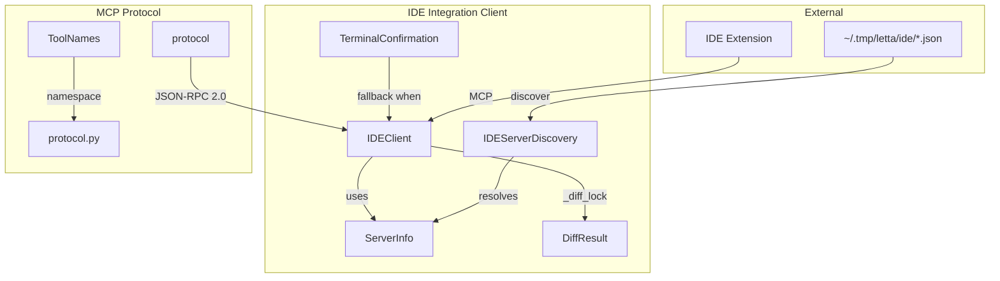

# 核心概念

## 概述

`jcode-ide-py` 是 jcode Agent 与 IDE 扩展之间的 MCP（Model Context Protocol）通信桥梁，使 Agent 的文件编辑操作可以通过 IDE 展示 diff 预览，用户在 IDE 中直接接受或拒绝修改。

## 系统角色

```
jcode Agent
    ↓ open_diff(file, new_content)
IDEClient (httpx async)
    ↓ POST /mcp (JSON-RPC 2.0, Bearer token auth)
IDE Extension (VS Code MCP Server)
    ↓ 展示 diff 视图，等待用户操作
IDEClient ← response (accepted/rejected/error)
```

## 关键术语

| 术语 | 定义 | 位置 |
|------|------|------|
| **MCP** | Model Context Protocol，JSON-RPC 2.0 over HTTP | `protocol.py:8` |
| **IDEClient** | MCP 客户端，负责与 IDE 扩展通信 | `client.py:80` |
| **IDEServerDiscovery** | 服务发现，通过端口文件定位 IDE 扩展 | `discovery.py:31` |
| **ServerInfo** | IDE 服务器元数据（port, token, workspace, pid, nonce） | `discovery.py:17` |
| **DiffResult** | diff 操作结果（accepted/rejected/error） | `client.py:30` |
| **TerminalConfirmation** | 终端降级方案，IDE 不可用时使用 | `fallback.py:49` |
| **ToolNames** | MCP 工具命名空间 `letta.ide.v1.*` | `protocol.py:11` |
| **_diff_lock** | asyncio.Lock，确保 diff 操作全局串行化 | `client.py:100` |

## 概念模型



## 设计哲学

1. **渐进式降级**：IDE 不可用时自动切换到终端确认
2. **并发安全**：diff 操作全局串行化，防止 IDE 状态混乱
3. **多窗口感知**：通过 workspace_path 精确匹配 IDE 实例
4. **协议版本化**：命名空间 `letta.ide.v1.*` 便于协议演进
5. **异步优先**：基于 httpx AsyncClient，复用连接池

## 关键约束

- `_diff_lock` 保证同一时刻只有一个 open_diff 操作进行
- MCP 工具命名空间带版本号便于后续协议演进
- 端口文件在 IDE 崩溃时不会自动清理（依赖 pid 存活检查过滤）
