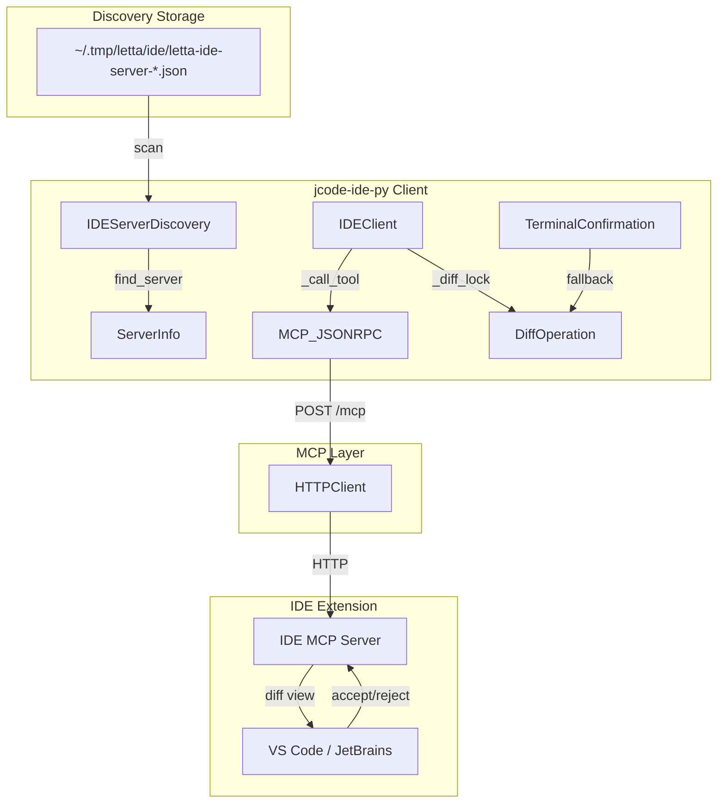
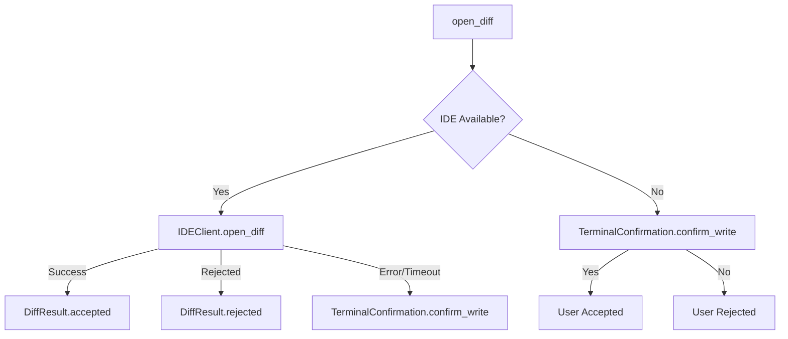
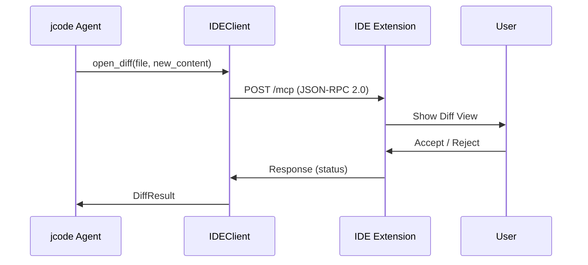

# 核心架构

## 概述

`jcode-ide-py` 采用客户端-服务器架构，通过 HTTP JSON-RPC 2.0 与 IDE 扩展通信。客户端支持上下文管理器模式复用连接池，以及即用即弃模式适用于偶发调用。

## 系统概览



## 组件层级

### 基础层（协议与工具）
```
protocol.py
├── ToolNames (letta.ide.v1.*)
├── DiffStatus (accepted/rejected/error)
├── MCP_TOOLS (工具定义)
└── DEFAULT_TIMEOUT_MS
```

### 中间层（客户端与发现）
```
client.py                    discovery.py
├── IDEClient                ├── IDEServerDiscovery
│   ├── __aenter__           │   ├── find_server()
│   │   └── AsyncClient      │   ├── _scan_port_files()
│   ├── __aexit__            │   ├── _ping_server()
│   ├── _call_tool()         │   └── _is_process_alive()
│   └── open_diff()          └── ServerInfo
│       └── _diff_lock           └── base_url property
```

### 高级层（降级与日志）
```
fallback.py                  _logging.py
├── TerminalConfirmation     └── _LoggerProxy
│   ├── confirm_write()          ├── debug()
│   ├── confirm_delete()         ├── error()
│   └── show_preview()          └── _render()
└── suffix_to_language()
```

## 关键模式

### 1. 上下文管理器模式（推荐）
```python
async with IDEClient(server_info) as client:
    result = await client.open_diff(file_path, new_content)
```
复用同一个 httpx.AsyncClient 连接池。

### 2. 即用即弃模式
```python
result = await IDEClient(server_info).open_diff(file_path, new_content)
```
每次创建临时 client 并在调用后关闭，适用于偶发调用。

### 3. 服务发现策略（优先级递降）
1. 环境变量 `LETTA_IDE_SERVER_PORT`
2. 端口文件扫描 + workspace_path 精确匹配
3. 端口文件扫描 + 第一个可用服务器

### 4. 渐进式降级


## 数据流

### Diff 操作序列


## 并发模型

`_diff_lock`（`asyncio.Lock`）保证同一时刻只有一个 open_diff 操作进行：
- VS Code 只能同时显示一个 diff 视图
- 并发打开会导致前一个被覆盖
- 其他只读操作（get_open_files、get_selection）不受此锁限制

## 扩展点

1. **自定义发现策略**：继承 `IDEServerDiscovery` 并覆盖 `_scan_port_files()`
2. **降级方案**：实现类似 `TerminalConfirmation` 的自定义降级
3. **工具命名空间**：在 `protocol.py` 中扩展 `ToolNames`
