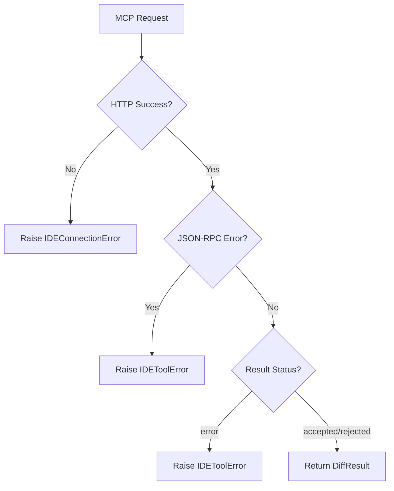

# MCP JSON-RPC 2.0 通信协议

## 概述

MCP（Model Context Protocol）是 jcode-ide-py 与 IDE 扩展之间的通信协议，基于 JSON-RPC 2.0 over HTTP，使 Agent 的文件编辑操作可以通过 IDE 展示 diff 预览。

**分数**: 95/100
- 业务核心度: 20/20 - 协议是整个系统的基础
- 用户影响: 25/25 - 所有功能依赖此协议
- 代码投入: 15/15 - 协议定义清晰完整
- 架构支撑度: 15/15 - 所有模块依赖协议
- 独特性与复杂度: 25/25 - 缺乏文档会导致严重误解

## 概览

协议定义在 `protocol.py`，包含：
- MCP 工具命名空间 `letta.ide.v1.*`
- 6 个核心工具定义
- 超时常量配置

## 契约

| 字段 | 值 |
|------|---|
| 版本 | 1.0.0 |
| 命名空间 | `letta.ide.v1` |
| 传输 | HTTP POST /mcp |
| 编码 | JSON-RPC 2.0 |
| 认证 | Bearer Token |

### JSON-RPC 请求格式

```json
{
    "jsonrpc": "2.0",
    "method": "tools/call",
    "params": {
        "name": "letta.ide.v1.openDiff",
        "arguments": {
            "filePath": "/path/to/file.py",
            "newContent": "new file content"
        }
    },
    "id": 1
}
```

### JSON-RPC 响应格式

```json
{
    "jsonrpc": "2.0",
    "result": {
        "status": "accepted",
        "content": null,
        "error": null
    },
    "id": 1
}
```

## MCP 工具定义

| 工具名 | 描述 | 输入Schema |
|--------|------|-----------|
| `letta.ide.v1.ping` | 健康检查与身份验证 | `{}` |
| `letta.ide.v1.openDiff` | 打开 diff 视图并阻塞等待用户操作 | `{filePath, newContent}` |
| `letta.ide.v1.closeDiff` | 关闭 diff 视图 | `{filePath}` |
| `letta.ide.v1.getOpenFiles` | 获取所有打开的文件 | `{}` |
| `letta.ide.v1.getActiveEditor` | 获取当前激活的编辑器 | `{}` |
| `letta.ide.v1.getSelection` | 获取当前选中的文本 | `{}` |

## API 参考

```python
# protocol.py:7-8
PROTOCOL_VERSION = "1.0.0"
NAMESPACE = "letta.ide.v1"

# protocol.py:11-17
class ToolNames:
    PING = f"{NAMESPACE}.ping"                    # protocol.py:12
    OPEN_DIFF = f"{NAMESPACE}.openDiff"           # protocol.py:13
    CLOSE_DIFF = f"{NAMESPACE}.closeDiff"         # protocol.py:14
    GET_OPEN_FILES = f"{NAMESPACE}.getOpenFiles"  # protocol.py:15
    GET_ACTIVE_EDITOR = f"{NAMESPACE}.getActiveEditor"  # protocol.py:16
    GET_SELECTION = f"{NAMESPACE}.getSelection"   # protocol.py:17

# protocol.py:50-52
DEFAULT_DIFF_TIMEOUT_MS = 300_000      # 5 分钟
DEFAULT_PING_TIMEOUT_MS = 2_000        # 2 秒
DEFAULT_TOOL_TIMEOUT_MS = 30_000       # 30 秒
```

## 实现细节

### _call_tool 内部实现 (`client.py:198-237`)

```python
async def _call_tool(self, name: str, arguments: dict[str, Any], *, timeout: float = 30.0) -> dict[str, Any]:
    client = self._get_client()
    response = await client.post(
        "/mcp",
        json={
            "jsonrpc": "2.0",
            "method": "tools/call",
            "params": {"name": name, "arguments": arguments},
            "id": 1
        },
        timeout=timeout,
    )
    result = response.json()
    # 错误处理...
    return tool_result
```

## 失败/降级图



## 集成矩阵

| 组件 | 依赖 | 失败策略 |
|------|------|----------|
| httpx | HTTP 客户端 | 超时后抛出 `IDEConnectionError` |
| Bearer Token | 认证 | 认证失败返回 JSON-RPC error |
| IDE Extension | MCP 服务器 | 无响应则超时 |

## 使用示例

### Algorithm: diff 操作完整流程

```
BEGIN
  1. 构建 JSON-RPC 请求
  2. 添加 Bearer Token 认证头
  3. POST 到 /mcp 端点
  4. 等待响应（默认 300s 超时）
  5. 解析 JSON-RPC 响应
  6. 验证 nonce（ping 时）
  7. 返回 DiffResult
END
```

```python
# 完整示例
import httpx

request = {
    "jsonrpc": "2.0",
    "method": "tools/call",
    "params": {
        "name": "letta.ide.v1.openDiff",
        "arguments": {"filePath": "/tmp/test.py", "newContent": "print('hello')"}
    },
    "id": 1
}

async with httpx.AsyncClient() as client:
    response = await client.post(
        "http://localhost:8123/mcp",
        headers={"Authorization": "Bearer token123"},
        json=request,
        timeout=300.0
    )
    result = response.json()
```

## 限制与权衡

- **单请求阻塞**: `openDiff` 是同步阻塞调用，直到用户接受或拒绝
- **无批量操作**: 每个工具调用独立发起 HTTP 请求
- **版本耦合**: 客户端和 IDE 扩展必须使用相同协议版本

## 相关特性

- [05-feature-diff-view.md](05-feature-diff-view.md) - Diff 操作的具体实现
- [03-api-and-usage.md](03-api-and-usage.md) - API 使用指南
