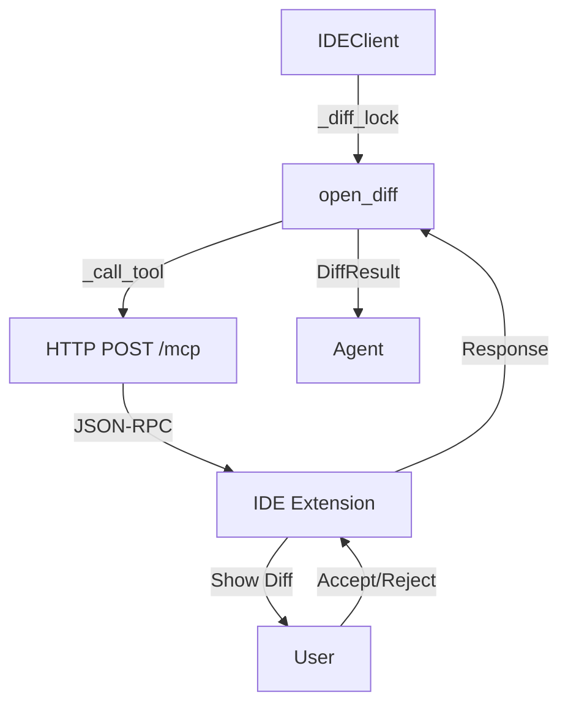
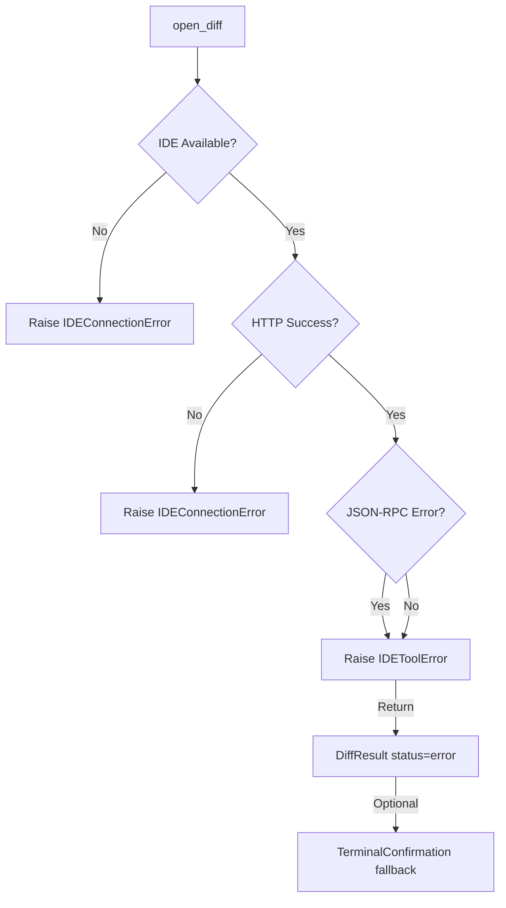

# Diff 视图交互

## 概述

Diff 视图交互是 jcode-ide-py 的核心功能，允许 Agent 通过 IDE 展示文件修改预览，用户在 IDE 中直接接受或拒绝修改。

**分数**: 92/100
- 业务核心度: 20/20 - 直接影响用户编辑体验
- 用户影响: 25/25 - 核心工作流
- 代码投入: 14/15 - 实现完整
- 架构支撑度: 14/15 - 被多个模块使用
- 独特性与复杂度: 24/25 - 涉及并发控制

## 概览

Diff 操作通过 `IDEClient.open_diff()` 发起，IDE 展示 unified diff 视图，用户操作结果通过 `DiffResult` 返回。

## 设计意图

### 解决的问题

- Agent 修改文件时用户无法预览
- 手动复制粘贴修改内容容易出错
- 用户需要在终端和 IDE 之间切换

### 设计决策

- **阻塞式**: `open_diff` 等待用户操作，提高交互确定性
- **全局锁**: 防止并发 diff 导致 IDE 状态混乱
- **超时机制**: 默认 5 分钟超时，防止无限等待

## 架构



## 契约

| 字段 | 值 |
|------|---|
| 输入 | `file_path: str`, `new_content: str` |
| 输出 | `DiffResult(status, content?, error?)` |
| 副作用 | IDE 打开 diff 视图 |
| 错误 | `IDEConnectionError`, `IDEToolError` |
| 幂等 | 否（多次调用打开多个 diff） |
| 超时 | 默认 300s，可配置 |

## API 参考

```python
# client.py:128-151
async def open_diff(
    self,
    file_path: str,
    new_content: str,
    *,
    timeout: float | None = None
) -> DiffResult:
    if timeout is None:
        timeout = DEFAULT_DIFF_TIMEOUT_MS / 1000  # 300s

    async with self._diff_lock:  # 全局串行化
        response = await self._call_tool(
            ToolNames.OPEN_DIFF,
            {"filePath": file_path, "newContent": new_content},
            timeout=timeout,
        )
        return DiffResult(
            status=response.get("status", "error"),
            content=response.get("content"),
            error=response.get("error"),
        )
```

```python
# client.py:30-42
@dataclass
class DiffResult:
    status: DiffStatus  # "accepted" | "rejected" | "error"
    content: str | None = None
    error: str | None = None

    @property
    def accepted(self) -> bool:
        return self.status == "accepted"

    @property
    def rejected(self) -> bool:
        return self.status == "rejected"
```

## 失败/降级图



## 集成矩阵

| 依赖 | 接口语义 | 失败策略 |
|------|----------|----------|
| `_diff_lock` | 确保串行化 | 阻塞等待 |
| `httpx.AsyncClient` | HTTP 通信 | 超时抛出 `IDEConnectionError` |
| Bearer Token | 认证 | 认证失败返回 JSON-RPC error |
| IDE Extension | diff 视图 | 无响应则超时 |

## 使用示例

### Algorithm: diff 操作流程

```
BEGIN
  1. 获取 ServerInfo（通过 discovery）
  2. 创建 IDEClient
  3. 调用 open_diff(file_path, new_content)
  4. 获取 _diff_lock（等待其他 diff 完成）
  5. 构造 JSON-RPC 请求
  6. POST 到 IDE
  7. 等待用户操作（最长 timeout）
  8. 解析响应返回 DiffResult
  9. 释放锁
END
```

```python
# 基本用法
async with IDEClient(server_info) as client:
    result = await client.open_diff(
        "/path/to/main.py",
        "new file content"
    )

    if result.accepted:
        print("Changes applied!")
    elif result.rejected:
        print("Changes rejected by user")
    else:
        print(f"Error: {result.error}")

# 自定义超时
result = await client.open_diff(
    "/path/to/file.py",
    content,
    timeout=600.0  # 10 分钟
)
```

## 限制与权衡

- **串行化限制**: 同一时刻只能有一个 diff 视图打开
- **阻塞调用**: `open_diff` 会阻塞直到用户操作或超时
- **IDE 依赖**: 需要 IDE 扩展运行
- **超时风险**: 大文件或复杂 diff 可能超时

## 相关特性

- [04-feature-mcp-protocol.md](04-feature-mcp-protocol.md) - 底层协议
- [06-feature-ide-discovery.md](06-feature-ide-discovery.md) - 如何发现 IDE
- [10-feature-terminal-fallback.md](10-feature-terminal-fallback.md) - IDE 不可用时的降级
