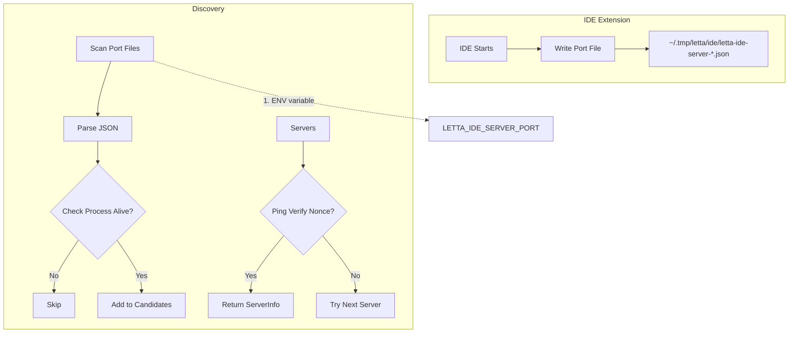
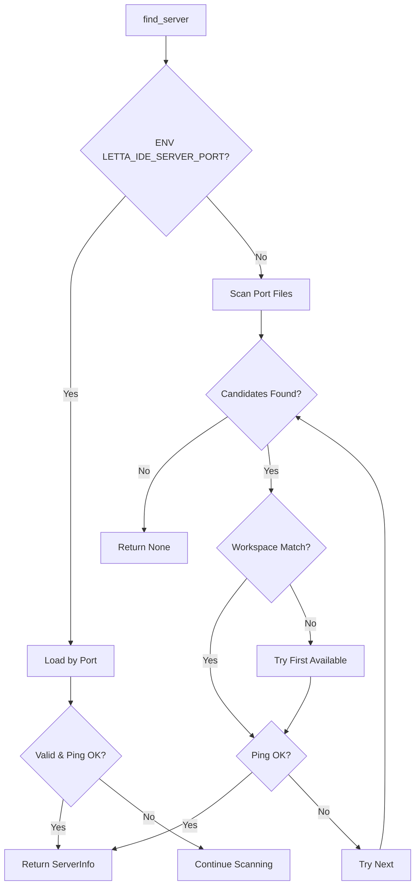

# IDE 服务发现与端口文件扫描

## 概述

IDEServerDiscovery 通过文件系统端口文件定位运行中的 IDE 扩展，支持多窗口场景下的精确匹配，并使用 ping 验证确保身份安全。

**分数**: 88/100
- 业务核心度: 18/20 - 多窗口支持必需
- 用户影响: 23/25 - 自动发现无需手动配置
- 代码投入: 13/15 - discovery.py 181 行
- 架构支撑度: 14/15 - 所有客户端使用
- 独特性与复杂度: 20/25 - 端口文件 + ping 验证

## 概览

IDE 扩展启动时在 `~/.tmp/letta/ide/` 目录写入端口文件，Discovery 扫描这些文件并通过进程存活检查和 ping 验证定位可用服务器。

## 设计意图

### 解决的问题

- 多 IDE 窗口同时运行（VS Code + JetBrains）
- 端口可能被其他进程复用
- IDE 崩溃后端口文件残留

### 设计决策

- **端口文件格式**: `letta-ide-server-<nonce>-<port>.json`
- **进程存活检查**: `os.kill(pid, 0)` 过滤僵尸文件
- **Nonce 验证**: ping 返回的 nonce 必须匹配，验证身份
- **环境变量支持**: 测试场景可直接指定端口

## 架构



## 契约

| 阶段 | 输入 | 输出 |
|------|------|------|
| 扫描 | `~/.tmp/letta/ide/*.json` | `list[ServerInfo]` |
| 验证 | `ServerInfo` | `bool` (nonce 匹配) |
| 存活检查 | `pid` | `bool` |

### 端口文件格式

```json
{
    "port": 8123,
    "authToken": "secret-token",
    "workspacePath": "/path/to/workspace",
    "pid": 12345,
    "createdAt": 1711500000,
    "instanceNonce": "unique-nonce"
}
```

## API 参考

```python
# discovery.py:31-50
class IDEServerDiscovery:
    PORT_FILE_DIR: ClassVar[Path] = Path.home() / ".tmp" / "letta" / "ide"

    @classmethod
    async def find_server(
        cls,
        workspace_path: str | None = None,
        verify_ping: bool = True,
    ) -> ServerInfo | None:
        # 1. 环境变量优先
        if port_str := os.environ.get("LETTA_IDE_SERVER_PORT"):
            server = cls._load_server_by_port(int(port_str))
            if server and (not verify_ping or await cls._ping_server(server)):
                return server

        # 2. 扫描端口文件
        candidates = cls._scan_port_files()

        # 3. workspace 精确匹配
        if workspace_path:
            for server in candidates:
                if server.workspace_path == workspace_path:
                    if not verify_ping or await cls._ping_server(server):
                        return server

        # 4. 第一个可用服务器
        for server in candidates:
            if not verify_ping or await cls._ping_server(server):
                return server

        return None
```

## 失败/降级图



## 集成矩阵

| 依赖 | 接口语义 | 失败策略 |
|------|----------|----------|
| `Path.glob()` | 扫描端口文件 | 无则返回空列表 |
| `os.kill(pid, 0)` | 进程存活检查 | OSError 则认为不存活 |
| `httpx.AsyncClient` | ping 验证 | 超时则失败 |
| `json.loads()` | 解析端口文件 | JSONDecodeError 则跳过 |

## 核心方法

### _scan_port_files (`discovery.py:100-115`)

```python
@classmethod
def _scan_port_files(cls) -> list[ServerInfo]:
    if not cls.PORT_FILE_DIR.exists():
        return []

    servers: list[ServerInfo] = []
    for path in cls.PORT_FILE_DIR.glob("letta-ide-server-*.json"):
        try:
            server = cls._parse_port_file(path)
            if server and cls._is_process_alive(server.pid):
                servers.append(server)
        except (json.JSONDecodeError, OSError, KeyError):
            continue

    return sorted(servers, key=lambda server: server.created_at, reverse=True)
```

### _ping_server (`discovery.py:130-151`)

```python
@classmethod
async def _ping_server(cls, server: ServerInfo) -> bool:
    try:
        async with httpx.AsyncClient(timeout=2.0) as client:
            response = await client.post(
                f"{server.base_url}/mcp",
                headers={"Authorization": f"Bearer {server.auth_token}"},
                json={
                    "jsonrpc": "2.0",
                    "method": "tools/call",
                    "params": {"name": ToolNames.PING, "arguments": {}},
                    "id": 1,
                },
            )
            result = response.json()
            nonce = result.get("result", {}).get("nonce")
            return nonce == server.instance_nonce
    except Exception:
        return False
```

## 使用示例

```python
# 基本发现
server = await IDEServerDiscovery.find_server()

# 精确匹配 workspace
server = await IDEServerDiscovery.find_server(
    workspace_path="/path/to/project"
)

# 跳过 ping 验证（快速检查）
server = await IDEServerDiscovery.find_server(
    workspace_path="/path/to/project",
    verify_ping=False
)

# 清理僵尸端口文件
removed = IDEServerDiscovery.cleanup_stale_port_files()
print(f"Removed {removed} stale port files")
```

## 限制与权衡

- **端口文件残留**: IDE 崩溃后不会自动清理
- **权限依赖**: 需要能读取 `~/.tmp/letta/ide/` 目录
- **Nonce 预测**: 如果 nonce 可预测，存在安全风险
- **多实例**: 同一 workspace 多个实例时选择最新的

## 相关特性

- [04-feature-mcp-protocol.md](04-feature-mcp-protocol.md) - ping 工具定义
- [03-api-and-usage.md](03-api-and-usage.md) - API 使用指南
- [08-feature-bearer-auth.md](08-feature-bearer-auth.md) - Token 认证
