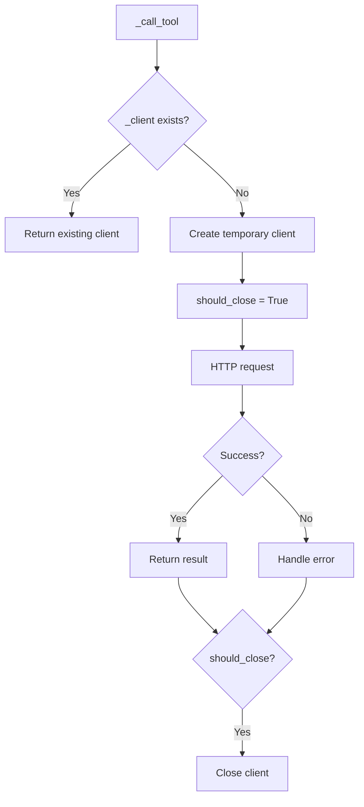

# 异步 HTTP 客户端生命周期管理

## 概述

IDEClient 支持两种使用模式：上下文管理器模式复用连接池，即用即弃模式适用于偶发调用。通过 `_get_client()` 方法统一入口。

**分数**: 85/100
- 业务核心度: 15/20 - 连接管理影响性能
- 用户影响: 22/25 - 影响使用便利性
- 代码投入: 15/15 - 实现完整
- 架构支撑度: 15/15 - 核心抽象
- 独特性与复杂度: 18/25 - 通用模式

## 概览

```mermaid
graph TB
    subgraph "上下文管理器模式"
        A1[async with IDEClient] --> A2[__aenter__ creates client]
        A2 --> A3[client = _get_client returns _client]
        A3 --> A4[__aexit__ closes client]
    end

    subgraph "即用即弃模式"
        B1[IDEClient(...).open_diff] --> B2[_get_client called]
        B2 --> B3[_client is None]
        B3 --> B4[Creates temporary client]
        B4 --> B5[__aexit__ not called]
        B5 --> B6[finally: should_close=True]
    end
```

## 设计意图

### 解决的问题

- 频繁创建销毁 HTTP 连接开销大
- 偶发调用时占用连接池资源
- 连接生命周期管理混乱

### 设计决策

- **上下文管理器**: 推荐模式，复用连接池
- **即用即弃**: 内部通过 `should_close` 标记自动关闭
- **统一入口**: `_get_client()` 隐藏差异

## 契约

| 模式 | 创建 | 销毁 | 适用场景 |
|------|------|------|----------|
| 上下文管理器 | `__aenter__` | `__aexit__` | 多次调用 |
| 即用即弃 | `_get_client` | `finally` 块 | 单次调用 |

## API 参考

```python
# client.py:80-124
class IDEClient:
    def __init__(self, server_info: ServerInfo):
        self.server_info = server_info
        self._diff_lock = asyncio.Lock()
        self._client: httpx.AsyncClient | None = None

    async def __aenter__(self) -> IDEClient:
        self._client = httpx.AsyncClient(
            base_url=self.server_info.base_url,
            headers={"Authorization": f"Bearer {self.server_info.auth_token}"},
        )
        return self

    async def __aexit__(self, *args: Any) -> None:
        if self._client:
            await self._client.aclose()
            self._client = None

    def _get_client(self) -> httpx.AsyncClient:
        if self._client:
            return self._client
        return httpx.AsyncClient(
            base_url=self.server_info.base_url,
            headers={"Authorization": f"Bearer {self.server_info.auth_token}"},
        )
```

## 失败/降级图



## 集成矩阵

| 依赖 | 接口语义 | 失败策略 |
|------|----------|----------|
| `httpx.AsyncClient` | HTTP 客户端 | 超时抛出 `httpx.TimeoutException` |
| `asyncio.Lock` | 串行化控制 | - |
| Bearer Token | 认证头 | 每次请求添加 |

## 使用示例

### Algorithm: 连接生命周期

```
BEGIN (上下文管理器)
  1. async with IDEClient(server_info)
  2. __aenter__ creates _client
  3. _get_client returns _client
  4. Multiple tool calls share same client
  5. __aexit__ closes _client
END

BEGIN (即用即弃)
  1. client = IDEClient(server_info)
  2. call tool
  3. _get_client creates temporary client
  4. should_close = True
  5. finally: client.aclose()
END
```

```python
# 推荐：上下文管理器模式
async with IDEClient(server_info) as client:
    # 复用连接池
    result1 = await client.open_diff(path1, content1)
    result2 = await client.open_diff(path2, content2)
    files = await client.get_open_files()

# 即用即弃：单次调用
result = await IDEClient(server_info).open_diff(path, content)
```

## 限制与权衡

- **连接泄漏风险**: 即用即弃模式如果异常发生在 `aclose()` 前可能泄漏
- **池大小**: httpx 默认池大小限制
- **超时管理**: 需要合理设置各层级超时

## 相关特性

- [04-feature-mcp-protocol.md](04-feature-mcp-protocol.md) - 协议层
- [05-feature-diff-view.md](05-feature-diff-view.md) - diff 操作
- [09-feature-diff-lock.md](09-feature-diff-lock.md) - 并发控制
