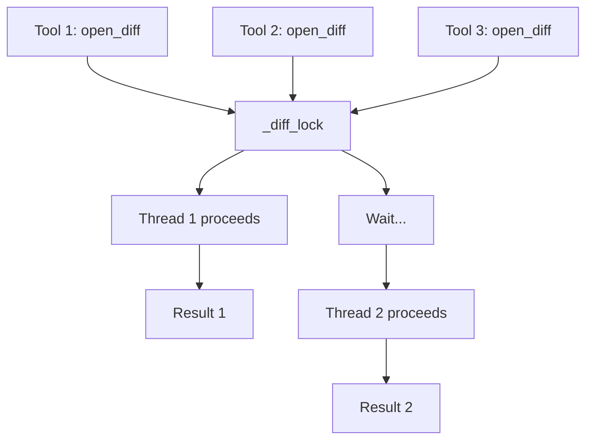
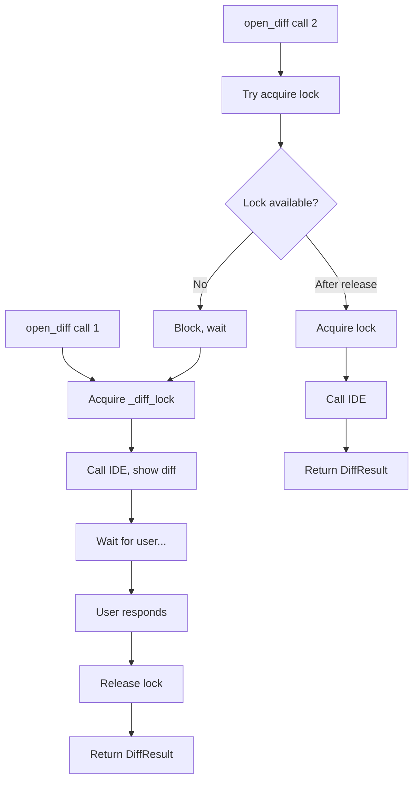

# Diff 操作全局串行化锁

## 概述

`_diff_lock`（`asyncio.Lock`）保证同一时刻只有一个 `open_diff` 操作在进行，防止多个工具调用同时打开 diff 视图导致 IDE 状态混乱。

**分数**: 82/100
- 业务核心度: 12/20 - IDE 约束决定
- 用户影响: 20/25 - 防止 UI 混乱
- 代码投入: 15/15 - 简洁实现
- 架构支撑度: 15/15 - 核心约束
- 独特性与复杂度: 20/25 - VS Code 限制

## 概览



## 设计意图

### 解决的问题

- VS Code 只能同时显示一个 diff 视图
- 并发 open_diff 会导致前一个被覆盖
- 用户操作结果无法正确对应

### 设计决策

- **全局锁**: 所有 diff 操作共享同一把锁
- **只读不受限**: `get_open_files`、`get_selection` 可并发
- **锁粒度**: 只保护 `open_diff` 调用

## 契约

| 字段 | 值 |
|------|---|
| 类型 | `asyncio.Lock` |
| 持有者 | `IDEClient` 实例 |
| 保护范围 | `open_diff()` |
| 并发读操作 | `get_open_files`, `get_selection`, `get_active_editor` |

## API 参考

```python
# client.py:98-100
class IDEClient:
    def __init__(self, server_info: ServerInfo):
        self.server_info = server_info
        self._diff_lock = asyncio.Lock()  # 初始化锁
        self._client: httpx.AsyncClient | None = None

# client.py:128-132
async def open_diff(self, file_path: str, new_content: str, *, timeout: float | None = None) -> DiffResult:
    async with self._diff_lock:  # 获取锁
        try:
            response = await self._call_tool(...)
            return DiffResult(...)
        except IDEError as exc:
            return DiffResult(status="error", error=str(exc))
```

## 失败/降级图



## 集成矩阵

| 依赖 | 接口语义 | 失败策略 |
|------|----------|----------|
| `asyncio.Lock` | 异步锁 | 阻塞等待 |
| `open_diff` | 唯一写操作 | 串行执行 |
| 只读操作 | 无锁保护 | 可并发执行 |

## 使用示例

```python
# 两个 diff 调用会串行执行
async with IDEClient(server) as client:
    # 这两个会排队
    result1 = await client.open_diff("file1.py", content1)
    result2 = await client.open_diff("file2.py", content2)

    # 这些可以并发
    files_task = client.get_open_files()
    editor_task = client.get_active_editor()
    files, editor = await asyncio.gather(files_task, editor_task)
```

## 限制与权衡

- **性能**: 多个 diff 调用必须排队
- **不可重入**: 同一协程内不能重复获取锁
- **单实例**: 锁在实例级别，不同 `IDEClient` 实例不共享

## 相关特性

- [05-feature-diff-view.md](05-feature-diff-view.md) - diff 操作详情
- [07-feature-async-client.md](07-feature-async-client.md) - 连接管理
- [03-api-and-usage.md](03-api-and-usage.md) - API 使用
