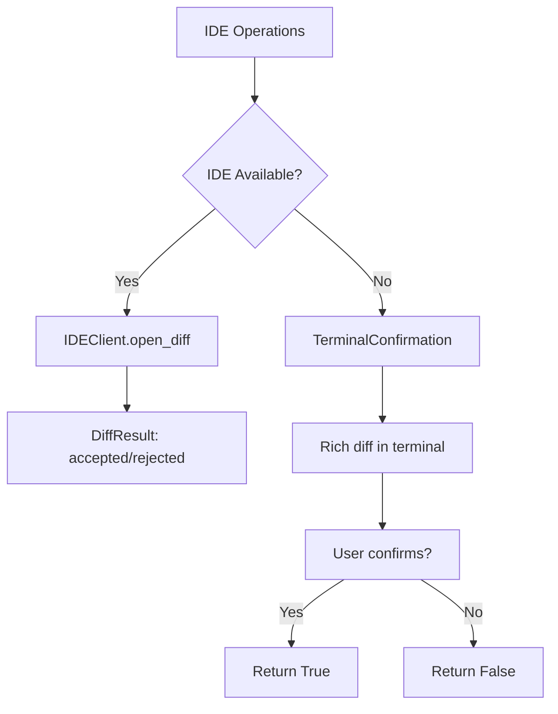

# 终端降级方案

## 概述

当 IDE 不可用时，TerminalConfirmation 通过 Rich 在终端渲染 unified diff 并请求用户确认，实现渐进式降级。

**分数**: 78/100
- 业务核心度: 15/20 - 可靠性保障
- 用户影响: 23/25 - 无 IDE 时仍可用
- 代码投入: 12/15 - 107 行
- 架构支撑度: 13/15 - 降级策略核心
- 独特性与复杂度: 15/25 - 复用成熟库

## 概览



## 设计意图

### 解决的问题

- IDE 扩展未运行
- 网络问题无法连接
- IDE 崩溃或无响应

### 设计决策

- **Rich 渲染**: 美观的 diff 显示
- **unified diff 格式**: 标准格式易理解
- **确认模式**: 明确要求用户输入

## 契约

| 方法 | 输入 | 输出 | 副作用 |
|------|------|------|--------|
| `confirm_write` | `file_path, new_content` | `bool` | 渲染 diff，提示确认 |
| `confirm_delete` | `file_path` | `bool` | 显示删除警告 |
| `show_preview` | `file_path, content` | `None` | 渲染代码预览 |

## API 参考

```python
# fallback.py:49-82
class TerminalConfirmation:
    def __init__(self, console: Console | None = None):
        self.console = console or Console()

    async def confirm_write(self, file_path: str, new_content: str, *, show_diff: bool = True) -> bool:
        # 1. 读取原文件
        original = ""
        if path.exists():
            original = path.read_text()

        # 2. 生成 unified diff
        diff_lines = list(unified_diff(
            original.splitlines(keepends=True),
            new_content.splitlines(keepends=True),
            fromfile=f"a/{path.name}",
            tofile=f"b/{path.name}",
        ))

        # 3. Rich 渲染
        self.console.print(Syntax("".join(diff_lines), "diff", theme="monokai"))

        # 4. 请求确认
        return Confirm.ask("[bold]Apply these changes?[/]")
```

## 失败/降级图

```mermaid
flowchart TD
    A[confirm_write] --> B{show_diff?}
    B -->|Yes| C[Read original file]
    C --> D{File exists?}
    D -->|Yes| E[Read content]
    D -->|No| F[Continue with empty]
    E --> G[Generate unified diff]
    F --> G
    G --> H{Rich diff lines?}
    H -->|Yes| I[Print syntax highlighted diff]
    H -->|No| J[Print "No changes"]
    I --> K[Prompt user]
    J --> K
    K --> L{User confirms?}
    L -->|Yes| M[Return True]
    L -->|No| N[Return False]
```

## 集成矩阵

| 依赖 | 接口语义 | 失败策略 |
|------|----------|----------|
| `rich.Console` | 终端输出 | - |
| `rich.prompt.Confirm` | 用户确认 | 默认 False |
| `rich.syntax.Syntax` | 语法高亮 | - |
| `difflib.unified_diff` | diff 生成 | 返回空则无变化 |

## 使用示例

```python
from jcode_ide import TerminalConfirmation

fallback = TerminalConfirmation()

# 降级确认写操作
if await fallback.confirm_write("/path/to/file.py", new_content):
    # 写入文件
    Path("/path/to/file.py").write_text(new_content)

# 确认删除
if await fallback.confirm_delete("/path/to/file.py"):
    Path("/path/to/file.py").unlink()

# 预览内容
await fallback.show_preview("/path/to/file.py", code_content)
```

## 限制与权衡

- **无 IDE 功能**: 无法获得 IDE 特定的 diff 视图
- **终端限制**: 大文件 diff 可能难以阅读
- **交互阻塞**: 需要用户实时响应
- **字符编码**: 二进制文件处理受限

## 相关特性

- [05-feature-diff-view.md](05-feature-diff-view.md) - IDE diff 操作
- [06-feature-ide-discovery.md](06-feature-ide-discovery.md) - IDE 可用性检测
- [03-api-and-usage.md](03-api-and-usage.md) - API 使用指南
