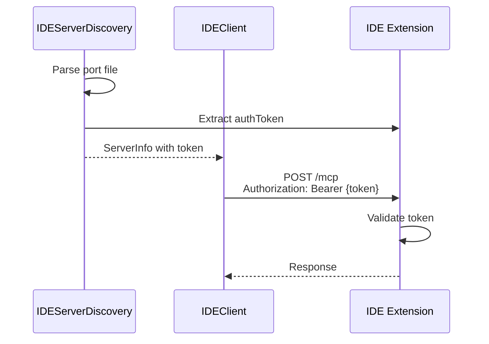
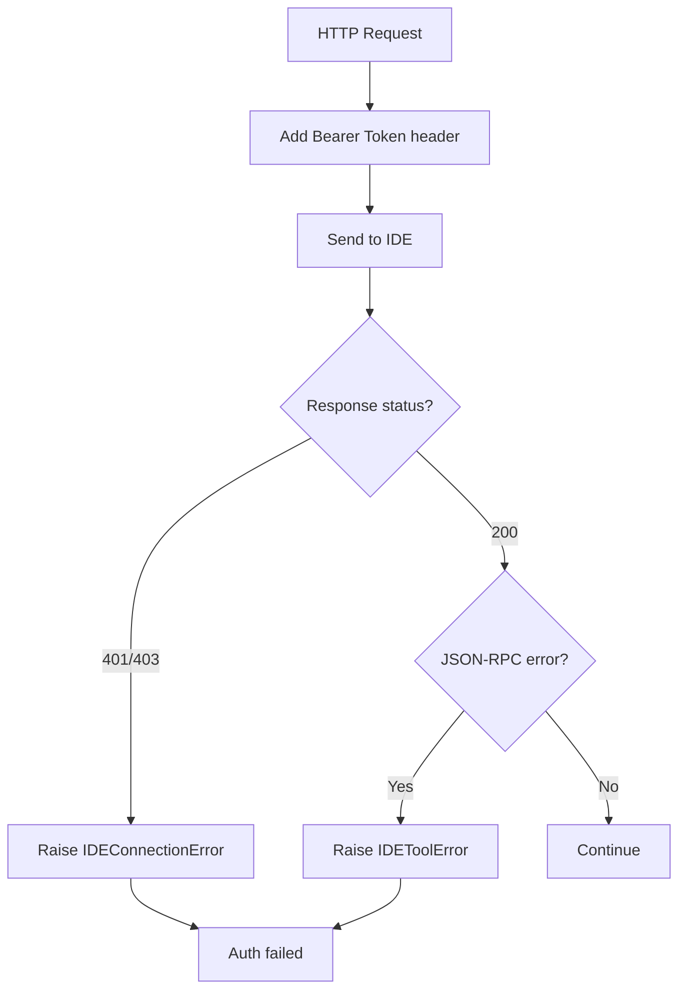

# Bearer Token 认证机制

## 概述

IDEClient 通过 Bearer Token 认证与 IDE 扩展通信，Token 在服务发现时从端口文件获取，每次请求通过 HTTP `Authorization` 头传递。

**分数**: 72/100
- 业务核心度: 15/20 - 安全必需
- 用户影响: 15/25 - 静默认证
- 代码投入: 10/15 - 简洁实现
- 架构支撑度: 15/15 - 核心安全
- 独特性与复杂度: 17/25 - 标准模式

## 概览



## 设计意图

### 解决的问题

- 防止未授权访问 IDE 扩展
- 区分不同 IDE 实例
- 端口复用场景下的身份验证

### 设计决策

- **Token 来源**: IDE 扩展写入端口文件
- **传输方式**: HTTP Bearer Token 头
- **验证时机**: 每次请求 IDE 验证

## 契约

| 字段 | 值 |
|------|---|
| 头格式 | `Authorization: Bearer {token}` |
| Token 来源 | 端口文件 `authToken` 字段 |
| 验证结果 | JSON-RPC error 或 nonce 不匹配 |

## API 参考

```python
# discovery.py:17-28
@dataclass
class ServerInfo:
    port: int
    auth_token: str
    workspace_path: str
    pid: int
    created_at: int
    instance_nonce: str

    @property
    def base_url(self) -> str:
        return f"http://localhost:{self.port}"

# discovery.py:119-127
@classmethod
def _parse_port_file(cls, path: Path) -> ServerInfo:
    data = json.loads(path.read_text())
    return ServerInfo(
        port=data["port"],
        auth_token=data["authToken"],  # 提取 token
        workspace_path=data["workspacePath"],
        pid=data["pid"],
        created_at=data["createdAt"],
        instance_nonce=data["instanceNonce"],
    )

# client.py:105-108
async def __aenter__(self) -> IDEClient:
    self._client = httpx.AsyncClient(
        base_url=self.server_info.base_url,
        headers={"Authorization": f"Bearer {self.server_info.auth_token}"},
    )
    return self
```

## 失败/降级图



## 集成矩阵

| 依赖 | 接口语义 | 失败策略 |
|------|----------|----------|
| `httpx.AsyncClient` | HTTP 头设置 | - |
| `authToken` | 端口文件字段 | 缺失则 KeyError |
| `nonce` | 身份验证补充 | ping 时验证 |

## 使用示例

```python
# Token 自动从 ServerInfo 获取
server = await IDEServerDiscovery.find_server()
# server.auth_token 已包含 token

async with IDEClient(server) as client:
    # Authorization 头自动添加
    result = await client.open_diff(path, content)

# 手动验证 token 存在
if server.auth_token:
    print(f"Authenticating to {server.base_url}")
```

## 限制与权衡

- **Token 传输**: HTTP 明文（应使用 HTTPS）
- **Token 存储**: 端口文件未加密存储
- **无刷新机制**: Token 过期无法自动刷新
- **Nonce 依赖**: 依赖 ping 验证身份，非强认证

## 相关特性

- [06-feature-ide-discovery.md](06-feature-ide-discovery.md) - 服务发现
- [04-feature-mcp-protocol.md](04-feature-mcp-protocol.md) - 协议层
- [09-feature-diff-lock.md](09-feature-diff-lock.md) - 并发控制
