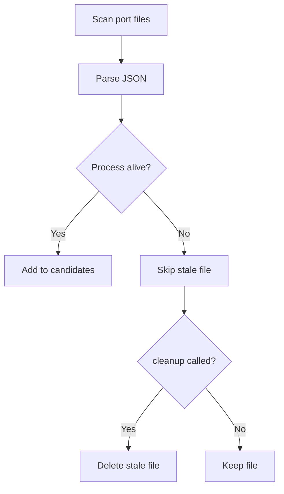

# 进程存活检查与端口文件清理

## 概述

`_is_process_alive()` 使用 `os.kill(pid, 0)` 检查进程是否存活，`cleanup_stale_port_files()` 清理已崩溃 IDE 的端口文件，防止误选僵尸进程。

**分数**: 68/100
- 业务核心度: 10/20 - 可靠性保障
- 用户影响: 18/25 - 避免错误选择
- 代码投入: 13/15 - 简洁实现
- 架构支撑度: 12/15 - 服务发现依赖
- 独特性与复杂度: 15/25 - 系统调用

## 概览



## 设计意图

### 解决的问题

- IDE 崩溃后端口文件残留
- 端口被新进程复用
- 误选僵尸进程导致连接失败

### 设计决策

- **信号 0 检查**: `os.kill(pid, 0)` 不发送信号，只检查权限
- **自动过滤**: 扫描时自动跳过不存活进程
- **手动清理**: `cleanup_stale_port_files()` 可选清理

## 契约

| 方法 | 输入 | 输出 | 副作用 |
|------|------|------|--------|
| `_is_process_alive` | `pid: int \| None` | `bool` | 无 |
| `cleanup_stale_port_files` | 无 | `int` (删除数量) | 删除文件 |

## API 参考

```python
# discovery.py:153-161
@classmethod
def _is_process_alive(cls, pid: int | None) -> bool:
    if pid is None:
        return False
    try:
        os.kill(pid, 0)  # 信号 0 不发送，只检查
        return True
    except OSError:
        return False

# discovery.py:163-181
@classmethod
def cleanup_stale_port_files(cls) -> int:
    if not cls.PORT_FILE_DIR.exists():
        return 0

    removed = 0
    for path in cls.PORT_FILE_DIR.glob("letta-ide-server-*.json"):
        try:
            data = json.loads(path.read_text())
            pid = data.get("pid")
            if not cls._is_process_alive(pid):
                path.unlink()
                removed += 1
        except (json.JSONDecodeError, OSError):
            continue

    return removed
```

## 集成矩阵

| 依赖 | 接口语义 | 失败策略 |
|------|----------|----------|
| `os.kill(pid, 0)` | 进程存在性检查 | OSError 表示不存在 |
| `path.unlink()` | 删除文件 | OSError 跳过 |

## 使用示例

```python
# 内部使用：扫描时自动过滤
candidates = IDEServerDiscovery._scan_port_files()
# 僵尸进程自动被过滤

# 手动清理
removed = IDEServerDiscovery.cleanup_stale_port_files()
print(f"Cleaned up {removed} stale port files")

# 检查特定进程
if IDEServerDiscovery._is_process_alive(12345):
    print("Process 12345 is alive")
else:
    print("Process 12345 is not running")
```

## 限制与权衡

- **权限依赖**: 需要对目标进程有发送信号的权限
- **僵尸进程**: `os.kill` 对僵尸进程返回成功
- **文件锁**: 端口文件可能被锁，无法删除
- **竞态条件**: 检查和清理之间进程可能退出

## 相关特性

- [06-feature-ide-discovery.md](06-feature-ide-discovery.md) - 服务发现
- [03-api-and-usage.md](03-api-and-usage.md) - API 使用指南
