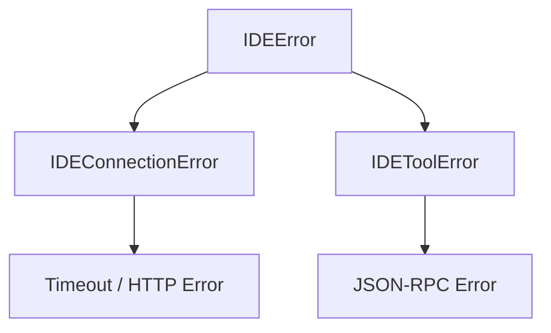
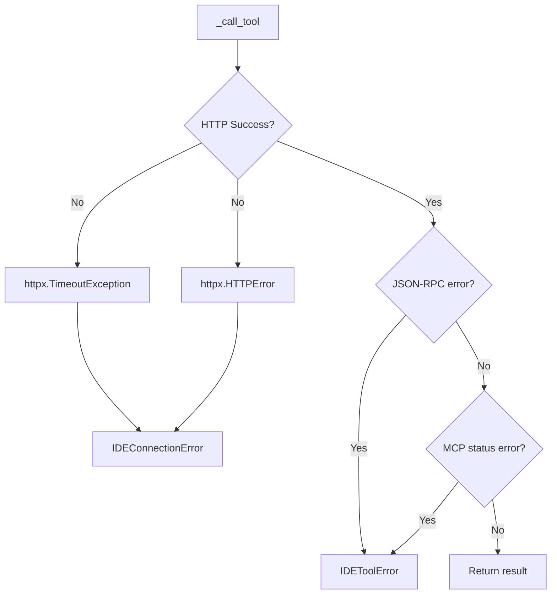

# 统一错误处理与异常层次

## 概述

jcode-ide-py 定义了 `IDEError` 异常层次结构，区分连接错误和工具执行错误，便于调用方精确处理。

**分数**: 65/100
- 业务核心度: 12/20 - API 可用性
- 用户影响: 18/25 - 错误信息清晰
- 代码投入: 10/15 - 简洁层次
- 架构支撑度: 10/15 - 贯穿全模块
- 独特性与复杂度: 15/25 - 通用模式

## 概览



## 设计意图

### 解决的问题

- 区分网络问题和业务逻辑错误
- 调用方需要精确处理不同错误
- 统一错误日志格式

### 设计决策

- **三层结构**: `IDEError` → `IDEConnectionError` / `IDEToolError`
- **错误消息保留**: 保留原始错误信息
- **日志绑定**: 错误日志包含上下文

## 异常层次

```python
# client.py:18-27
class IDEError(Exception):
    """IDE 相关错误基类"""
    pass

class IDEConnectionError(IDEError):
    """连接错误：网络、超时、认证失败"""
    pass

class IDEToolError(IDEError):
    """工具执行错误：MCP 工具返回 error"""
    pass
```

## API 参考

```python
# client.py:198-237
async def _call_tool(self, name: str, arguments: dict[str, Any], *, timeout: float = 30.0) -> dict[str, Any]:
    try:
        response = await client.post("/mcp", json=request, timeout=timeout)
        response.raise_for_status()
        result = response.json()

        # JSON-RPC error
        if "error" in result:
            raise IDEToolError(f"RPC error: {message}")

        # MCP tool 返回 error status
        tool_result = result.get("result", {})
        if name != ToolNames.OPEN_DIFF and tool_result.get("status") == "error":
            raise IDEToolError(error_msg)

        return tool_result

    except httpx.TimeoutException as exc:
        raise IDEConnectionError(f"Request timed out after {timeout}s") from exc
    except httpx.HTTPError as exc:
        raise IDEConnectionError(f"HTTP error: {exc}") from exc
```

## 失败/降级图



## 集成矩阵

| 异常类型 | 触发条件 | 处理策略 |
|----------|----------|----------|
| `IDEConnectionError` | 网络超时、HTTP 错误、认证失败 | 降级到 TerminalConfirmation |
| `IDEToolError` | MCP 工具返回 error | 记录日志，返回 DiffResult(status=error) |
| `httpx.TimeoutException` | 请求超时 | 同 IDEConnectionError |
| `httpx.HTTPError` | HTTP 4xx/5xx | 同 IDEConnectionError |

## 使用示例

```python
async with IDEClient(server) as client:
    try:
        result = await client.open_diff(path, content)
        if result.status == "error":
            print(f"Error: {result.error}")
    except IDEConnectionError as e:
        print(f"Cannot connect to IDE: {e}")
        # 降级到终端确认
        fallback = TerminalConfirmation()
        await fallback.confirm_write(path, content)
    except IDEToolError as e:
        print(f"IDE tool error: {e}")
```

## 限制与权衡

- **单错误消息**: 原始异常可能被覆盖
- **无重试机制**: 失败后不自动重试
- **日志分散**: 错误日志分散在多处

## 相关特性

- [05-feature-diff-view.md](05-feature-diff-view.md) - Diff 操作
- [10-feature-terminal-fallback.md](10-feature-terminal-fallback.md) - 降级方案
- [03-api-and-usage.md](03-api-and-usage.md) - API 使用指南
